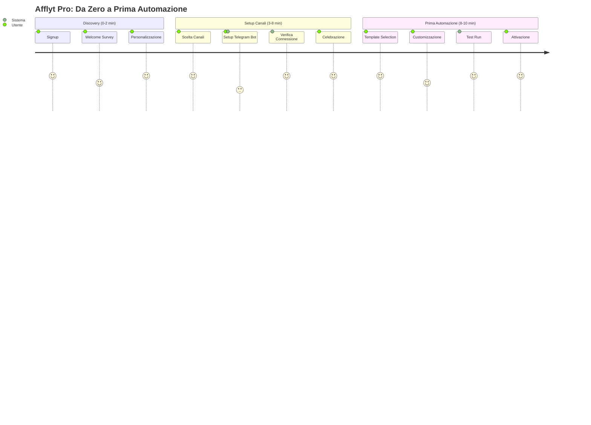

# UX/UI Study: No-Code Onboarding per Afflyt Pro 🚀

## USER JOURNEY MAP



## 1. WELCOME FLOW - "Mission Briefing"

### Screen 1: Welcome Survey Interattivo

```tsx
// components/onboarding/WelcomeFlow.tsx
'use client';

import { useState } from 'react';
import { motion, AnimatePresence } from 'framer-motion';
import { 
  Sparkles,
  Send,
  Mail,
  MessageSquare,
  Users,
  Target,
  TrendingUp,
  Zap,
  ArrowRight,
  Check
} from 'lucide-react';

export const WelcomeFlow = () => {
  const [step, setStep] = useState(1);
  const [profile, setProfile] = useState({
    goal: '',
    channels: [] as string[],
    audienceSize: '',
    experience: ''
  });

  const goals = [
    {
      id: 'monetize',
      title: 'Monetizzare la mia audience',
      description: 'Ho già follower, voglio guadagnare',
      icon: TrendingUp,
      color: 'from-green-400 to-emerald-600'
    },
    {
      id: 'automate',
      title: 'Automatizzare il mio lavoro',
      description: 'Smettere di fare copia-incolla manuale',
      icon: Zap,
      color: 'from-afflyt-cyan-400 to-afflyt-cyan-600'
    },
    {
      id: 'grow',
      title: 'Far crescere i miei canali',
      description: 'Più contenuti = più iscritti',
      icon: Users,
      color: 'from-purple-400 to-purple-600'
    }
  ];

  const channels = [
    { id: 'telegram', name: 'Telegram', icon: Send, users: '500M+' },
    { id: 'email', name: 'Email', icon: Mail, users: '4B+' },
    { id: 'discord', name: 'Discord', icon: MessageSquare, users: '150M+' }
  ];

  return (
    <div className="min-h-screen bg-gradient-to-br from-afflyt-dark-100 to-afflyt-dark-50 flex items-center justify-center p-6">
      {/* Background Animation */}
      <div className="absolute inset-0 overflow-hidden">
        <div className="absolute -top-40 -right-40 w-96 h-96 bg-afflyt-cyan-500/10 rounded-full blur-3xl animate-pulse" />
        <div className="absolute -bottom-40 -left-40 w-96 h-96 bg-purple-500/10 rounded-full blur-3xl animate-pulse delay-1000" />
      </div>

      <motion.div 
        className="relative w-full max-w-4xl"
        initial={{ opacity: 0, y: 20 }}
        animate={{ opacity: 1, y: 0 }}
        transition={{ duration: 0.6 }}
      >
        {/* Progress Bar */}
        <div className="mb-8">
          <div className="flex items-center justify-between mb-2">
            {[1, 2, 3, 4].map((s) => (
              <div key={s} className="flex items-center">
                <motion.div 
                  className={`w-10 h-10 rounded-full flex items-center justify-center font-bold ${
                    step >= s 
                      ? 'bg-gradient-to-br from-afflyt-cyan-400 to-afflyt-cyan-600 text-white' 
                      : 'bg-gray-700 text-gray-400'
                  }`}
                  animate={step === s ? { scale: [1, 1.2, 1] } : {}}
                  transition={{ duration: 0.3 }}
                >
                  {step > s ? <Check className="w-5 h-5" /> : s}
                </motion.div>
                {s < 4 && (
                  <div className={`w-full h-1 mx-2 ${
                    step > s ? 'bg-afflyt-cyan-500' : 'bg-gray-700'
                  }`} />
                )}
              </div>
            ))}
          </div>
          <div className="flex justify-between text-xs text-gray-400">
            <span>Obiettivi</span>
            <span>Canali</span>
            <span>Audience</span>
            <span>Pronti!</span>
          </div>
        </div>

        {/* Main Card */}
        <motion.div 
          className="bg-afflyt-dark-50/80 backdrop-blur-xl border border-afflyt-glass-border rounded-2xl p-8 shadow-2xl"
          layout
        >
          <AnimatePresence mode="wait">
            {step === 1 && (
              <motion.div
                key="step1"
                initial={{ opacity: 0, x: 20 }}
                animate={{ opacity: 1, x: 0 }}
                exit={{ opacity: 0, x: -20 }}
              >
                <div className="text-center mb-8">
                  <motion.div 
                    className="w-20 h-20 bg-gradient-to-br from-afflyt-cyan-400 to-afflyt-cyan-600 rounded-full flex items-center justify-center mx-auto mb-4"
                    animate={{ rotate: [0, 360] }}
                    transition={{ duration: 20, repeat: Infinity, ease: "linear" }}
                  >
                    <Sparkles className="w-10 h-10 text-white" />
                  </motion.div>
                  <h2 className="text-3xl font-bold text-white mb-2">
                    Ciao! Benvenuto in Afflyt Pro 👋
                  </h2>
                  <p className="text-gray-400">
                    In 2 minuti configuriamo tutto. Prima domanda:
                  </p>
                </div>

                <h3 className="text-xl font-semibold text-white mb-6">
                  Qual è il tuo obiettivo principale?
                </h3>

                <div className="grid gap-4">
                  {goals.map((goal, index) => (
                    <motion.button
                      key={goal.id}
                      initial={{ opacity: 0, y: 20 }}
                      animate={{ opacity: 1, y: 0 }}
                      transition={{ delay: index * 0.1 }}
                      onClick={() => {
                        setProfile({ ...profile, goal: goal.id });
                        setTimeout(() => setStep(2), 300);
                      }}
                      className={`p-6 rounded-xl border-2 transition-all text-left group hover:scale-[1.02] ${
                        profile.goal === goal.id
                          ? 'border-afflyt-cyan-500 bg-afflyt-cyan-500/10'
                          : 'border-gray-700 hover:border-gray-600 bg-gray-800/50'
                      }`}
                    >
                      <div className="flex items-center gap-4">
                        <div className={`w-14 h-14 rounded-xl bg-gradient-to-br ${goal.color} flex items-center justify-center group-hover:scale-110 transition-transform`}>
                          <goal.icon className="w-7 h-7 text-white" />
                        </div>
                        <div className="flex-1">
                          <p className="text-lg font-semibold text-white">
                            {goal.title}
                          </p>
                          <p className="text-sm text-gray-400 mt-1">
                            {goal.description}
                          </p>
                        </div>
                        <ArrowRight className="w-5 h-5 text-gray-500 group-hover:text-afflyt-cyan-400 transition-colors" />
                      </div>
                    </motion.button>
                  ))}
                </div>
              </motion.div>
            )}

            {step === 2 && (
              <motion.div
                key="step2"
                initial={{ opacity: 0, x: 20 }}
                animate={{ opacity: 1, x: 0 }}
                exit={{ opacity: 0, x: -20 }}
              >
                <h3 className="text-2xl font-bold text-white mb-2">
                  Dove pubblichi contenuti? 📢
                </h3>
                <p className="text-gray-400 mb-8">
                  Seleziona tutti i canali che usi (potrai aggiungerne altri dopo)
                </p>

                <div className="grid grid-cols-3 gap-4 mb-8">
                  {channels.map((channel, index) => (
                    <motion.button
                      key={channel.id}
                      initial={{ opacity: 0, scale: 0.8 }}
                      animate={{ opacity: 1, scale: 1 }}
                      transition={{ delay: index * 0.1 }}
                      onClick={() => {
                        const updatedChannels = profile.channels.includes(channel.id)
                          ? profile.channels.filter(c => c !== channel.id)
                          : [...profile.channels, channel.id];
                        setProfile({ ...profile, channels: updatedChannels });
                      }}
                      className={`relative p-6 rounded-xl border-2 transition-all ${
                        profile.channels.includes(channel.id)
                          ? 'border-afflyt-cyan-500 bg-afflyt-cyan-500/10 scale-105'
                          : 'border-gray-700 hover:border-gray-600 bg-gray-800/50'
                      }`}
                    >
                      {profile.channels.includes(channel.id) && (
                        <motion.div 
                          className="absolute top-3 right-3"
                          initial={{ scale: 0 }}
                          animate={{ scale: 1 }}
                          transition={{ type: "spring" }}
                        >
                          <div className="w-6 h-6 bg-afflyt-cyan-500 rounded-full flex items-center justify-center">
                            <Check className="w-4 h-4 text-white" />
                          </div>
                        </motion.div>
                      )}
                      
                      <channel.icon className={`w-8 h-8 mx-auto mb-3 ${
                        profile.channels.includes(channel.id) 
                          ? 'text-afflyt-cyan-400' 
                          : 'text-gray-400'
                      }`} />
                      <p className="font-semibold text-white">{channel.name}</p>
                      <p className="text-xs text-gray-500 mt-1">{channel.users} utenti</p>
                    </motion.button>
                  ))}
                </div>

                <button
                  onClick={() => setStep(3)}
                  disabled={profile.channels.length === 0}
                  className="w-full py-4 bg-gradient-to-r from-afflyt-cyan-500 to-afflyt-cyan-600 text-white font-semibold rounded-xl hover:shadow-lg hover:shadow-afflyt-cyan-500/25 transition-all disabled:opacity-50 disabled:cursor-not-allowed"
                >
                  Continua
                </button>
              </motion.div>
            )}

            {/* Altri step... */}
          </AnimatePresence>
        </motion.div>
      </motion.div>
    </div>
  );
};
```

## 2. CHANNEL CONNECTION FLOW - "Mission Setup"

### Telegram Bot Setup Wizard

```tsx
// components/onboarding/TelegramSetup.tsx
'use client';

import { useState, useEffect } from 'react';
import { motion } from 'framer-motion';
import { 
  Send,
  Copy,
  Check,
  AlertCircle,
  ExternalLink,
  ChevronRight,
  Loader2,
  Play,
  MessageSquare,
  Shield,
  Sparkles,
  Video
} from 'lucide-react';

export const TelegramSetup = () => {
  const [currentStep, setCurrentStep] = useState(0);
  const [botToken, setBotToken] = useState('');
  const [channelId, setChannelId] = useState('');
  const [isValidating, setIsValidating] = useState(false);
  const [validationStatus, setValidationStatus] = useState({
    token: null as null | 'valid' | 'invalid',
    channel: null as null | 'valid' | 'invalid'
  });

  const steps = [
    {
      id: 'intro',
      title: 'Connettiamo Telegram! 🚀',
      description: 'Ci vogliono solo 3 minuti',
      icon: Send
    },
    {
      id: 'create-bot',
      title: 'Crea il tuo Bot',
      description: 'Il tuo assistente automatico',
      icon: MessageSquare
    },
    {
      id: 'get-token',
      title: 'Copia il Token',
      description: 'La chiave segreta del bot',
      icon: Shield
    },
    {
      id: 'add-channel',
      title: 'Connetti al Canale',
      description: 'Dove pubblicare i deal',
      icon: Send
    },
    {
      id: 'verify',
      title: 'Verifica e Test',
      description: 'Tutto funziona!',
      icon: Check
    }
  ];

  const validateToken = async (token: string) => {
    setIsValidating(true);
    // Simulate API call
    await new Promise(resolve => setTimeout(resolve, 1500));
    
    const isValid = token.match(/^\d{10}:[A-Za-z0-9_-]{35}$/);
    setValidationStatus({ ...validationStatus, token: isValid ? 'valid' : 'invalid' });
    setIsValidating(false);
    
    if (isValid) {
      setTimeout(() => setCurrentStep(3), 1000);
    }
  };

  return (
    <div className="min-h-screen bg-gradient-to-br from-afflyt-dark-100 to-afflyt-dark-50 p-6">
      {/* Step Progress */}
      <div className="max-w-4xl mx-auto mb-8">
        <div className="flex items-center justify-between">
          {steps.map((step, index) => (
            <div key={step.id} className="flex items-center flex-1">
              <motion.div 
                className={`relative flex items-center justify-center w-12 h-12 rounded-full border-2 transition-all ${
                  currentStep > index 
                    ? 'bg-afflyt-cyan-500 border-afflyt-cyan-500' 
                    : currentStep === index
                    ? 'border-afflyt-cyan-500 bg-afflyt-cyan-500/20'
                    : 'border-gray-600 bg-gray-800'
                }`}
                animate={currentStep === index ? { scale: [1, 1.1, 1] } : {}}
              >
                {currentStep > index ? (
                  <Check className="w-5 h-5 text-white" />
                ) : (
                  <step.icon className={`w-5 h-5 ${
                    currentStep === index ? 'text-afflyt-cyan-400' : 'text-gray-400'
                  }`} />
                )}
              </motion.div>
              
              {index < steps.length - 1 && (
                <div className={`flex-1 h-1 mx-2 ${
                  currentStep > index ? 'bg-afflyt-cyan-500' : 'bg-gray-700'
                }`} />
              )}
            </div>
          ))}
        </div>
        
        {/* Step Labels */}
        <div className="flex justify-between mt-3">
          {steps.map((step, index) => (
            <div key={step.id} className="text-center" style={{ width: '20%' }}>
              <p className={`text-xs font-medium ${
                currentStep === index ? 'text-afflyt-cyan-400' : 'text-gray-500'
              }`}>
                {step.title}
              </p>
            </div>
          ))}
        </div>
      </div>

      {/* Main Content */}
      <div className="max-w-4xl mx-auto">
        {currentStep === 0 && (
          <motion.div
            initial={{ opacity: 0, y: 20 }}
            animate={{ opacity: 1, y: 0 }}
            className="bg-afflyt-dark-50/80 backdrop-blur-xl border border-afflyt-glass-border rounded-2xl p-8"
          >
            <div className="text-center mb-8">
              <motion.div 
                className="w-24 h-24 bg-gradient-to-br from-blue-400 to-blue-600 rounded-full flex items-center justify-center mx-auto mb-6"
                animate={{ y: [0, -10, 0] }}
                transition={{ duration: 2, repeat: Infinity }}
              >
                <Send className="w-12 h-12 text-white" />
              </motion.div>
              
              <h2 className="text-3xl font-bold text-white mb-4">
                Telegram = Il tuo nuovo superpotere 💪
              </h2>
              <p className="text-lg text-gray-300 mb-8">
                Con Afflyt Pro, il tuo canale Telegram diventa una macchina automatica per fare soldi.
                <br />
                <span className="text-afflyt-cyan-400">Zero copia-incolla. 100% automazione.</span>
              </p>
            </div>

            {/* Benefits */}
            <div className="grid grid-cols-3 gap-6 mb-8">
              {[
                { icon: Sparkles, title: 'Automatico', desc: 'Pubblica 24/7' },
                { icon: TrendingUp, title: 'Intelligente', desc: 'Solo deal top' },
                { icon: Shield, title: 'Sicuro', desc: 'Token privato' }
              ].map((benefit, i) => (
                <motion.div
                  key={i}
                  initial={{ opacity: 0, y: 20 }}
                  animate={{ opacity: 1, y: 0 }}
                  transition={{ delay: i * 0.1 }}
                  className="text-center"
                >
                  <div className="w-14 h-14 bg-afflyt-cyan-500/20 rounded-xl flex items-center justify-center mx-auto mb-3">
                    <benefit.icon className="w-7 h-7 text-afflyt-cyan-400" />
                  </div>
                  <p className="font-semibold text-white mb-1">{benefit.title}</p>
                  <p className="text-sm text-gray-400">{benefit.desc}</p>
                </motion.div>
              ))}
            </div>

            <button
              onClick={() => setCurrentStep(1)}
              className="w-full py-4 bg-gradient-to-r from-afflyt-cyan-500 to-afflyt-cyan-600 text-white font-semibold rounded-xl hover:shadow-lg hover:shadow-afflyt-cyan-500/25 transition-all flex items-center justify-center gap-2"
            >
              Iniziamo! È facilissimo
              <ChevronRight className="w-5 h-5" />
            </button>

            <p className="text-center text-sm text-gray-500 mt-4">
              ⏱ Tempo stimato: 3 minuti
            </p>
          </motion.div>
        )}

        {currentStep === 1 && (
          <motion.div
            initial={{ opacity: 0, x: 20 }}
            animate={{ opacity: 1, x: 0 }}
            className="grid grid-cols-2 gap-8"
          >
            {/* Left: Instructions */}
            <div className="bg-afflyt-dark-50/80 backdrop-blur-xl border border-afflyt-glass-border rounded-2xl p-6">
              <h3 className="text-2xl font-bold text-white mb-6">
                Step 1: Apri BotFather su Telegram 🤖
              </h3>

              <div className="space-y-4">
                <div className="flex gap-4">
                  <div className="w-8 h-8 bg-afflyt-cyan-500/20 rounded-full flex items-center justify-center flex-shrink-0">
                    <span className="text-afflyt-cyan-400 font-bold">1</span>
                  </div>
                  <div>
                    <p className="text-white font-medium mb-2">
                      Apri Telegram sul tuo telefono o desktop
                    </p>
                    <div className="bg-gray-800/50 rounded-lg p-3">
                      <code className="text-sm text-gray-300">
                        Cerca: <span className="text-afflyt-cyan-400 font-semibold">@BotFather</span>
                      </code>
                    </div>
                  </div>
                </div>

                <div className="flex gap-4">
                  <div className="w-8 h-8 bg-afflyt-cyan-500/20 rounded-full flex items-center justify-center flex-shrink-0">
                    <span className="text-afflyt-cyan-400 font-bold">2</span>
                  </div>
                  <div>
                    <p className="text-white font-medium mb-2">
                      Clicca "Start" e poi invia questo comando:
                    </p>
                    <div className="bg-gray-800/50 rounded-lg p-3 flex items-center justify-between">
                      <code className="text-sm text-afflyt-cyan-400 font-mono">/newbot</code>
                      <button className="text-gray-400 hover:text-white transition-colors">
                        <Copy className="w-4 h-4" />
                      </button>
                    </div>
                  </div>
                </div>

                <div className="flex gap-4">
                  <div className="w-8 h-8 bg-afflyt-cyan-500/20 rounded-full flex items-center justify-center flex-shrink-0">
                    <span className="text-afflyt-cyan-400 font-bold">3</span>
                  </div>
                  <div>
                    <p className="text-white font-medium mb-2">
                      Scegli un nome per il bot (es: "I miei deal Amazon")
                    </p>
                    <p className="text-sm text-gray-400">
                      Poi un username che finisce con "bot" (es: midealamazon_bot)
                    </p>
                  </div>
                </div>
              </div>

              <div className="mt-6 p-4 bg-green-500/10 border border-green-500/30 rounded-xl">
                <p className="text-sm text-green-400">
                  💡 <span className="font-semibold">Tip:</span> Il nome può essere cambiato dopo, l'username no!
                </p>
              </div>

              <button
                onClick={() => window.open('https://t.me/BotFather', '_blank')}
                className="mt-6 w-full py-3 bg-blue-500/20 hover:bg-blue-500/30 border border-blue-500/50 text-blue-400 font-medium rounded-xl transition-all flex items-center justify-center gap-2"
              >
                <ExternalLink className="w-4 h-4" />
                Apri BotFather
              </button>
            </div>

            {/* Right: Visual Guide */}
            <div className="bg-afflyt-dark-50/80 backdrop-blur-xl border border-afflyt-glass-border rounded-2xl p-6">
              <div className="aspect-video bg-gray-800 rounded-xl flex items-center justify-center mb-4 relative overflow-hidden">
                {/* Simulated Chat Interface */}
                <div className="w-full h-full p-4">
                  <div className="bg-gray-900 rounded-lg p-3 max-w-[80%] mb-3">
                    <p className="text-sm text-gray-300">BotFather</p>
                    <p className="text-white">Alright, a new bot. How are we going to call it?</p>
                  </div>
                  <div className="bg-blue-600/20 rounded-lg p-3 max-w-[80%] ml-auto mb-3">
                    <p className="text-white">I miei deal Amazon</p>
                  </div>
                  <div className="bg-gray-900 rounded-lg p-3 max-w-[80%]">
                    <p className="text-sm text-gray-300">BotFather</p>
                    <p className="text-white">Good. Now let's choose a username for your bot...</p>
                  </div>
                </div>
                
                {/* Play button overlay */}
                <button className="absolute inset-0 flex items-center justify-center bg-black/40 group hover:bg-black/50 transition-colors">
                  <div className="w-16 h-16 bg-white/20 backdrop-blur rounded-full flex items-center justify-center group-hover:scale-110 transition-transform">
                    <Play className="w-8 h-8 text-white ml-1" />
                  </div>
                </button>
              </div>

              <div className="flex items-center gap-2 text-sm text-gray-400 mb-6">
                <Video className="w-4 h-4" />
                <span>Guarda il video tutorial (1:30)</span>
              </div>

              <button
                onClick={() => setCurrentStep(2)}
                className="w-full py-3 bg-gradient-to-r from-afflyt-cyan-500 to-afflyt-cyan-600 text-white font-semibold rounded-xl hover:shadow-lg transition-all"
              >
                Ho creato il bot! Avanti →
              </button>

              <button
                onClick={() => {/* Open help */}}
                className="w-full py-3 text-gray-400 hover:text-white transition-colors mt-3"
              >
                Ho bisogno di aiuto
              </button>
            </div>
          </motion.div>
        )}

        {currentStep === 2 && (
          <motion.div
            initial={{ opacity: 0, x: 20 }}
            animate={{ opacity: 1, x: 0 }}
            className="max-w-2xl mx-auto"
          >
            <div className="bg-afflyt-dark-50/80 backdrop-blur-xl border border-afflyt-glass-border rounded-2xl p-8">
              <h3 className="text-2xl font-bold text-white mb-6">
                Step 2: Copia il Token del Bot 🔑
              </h3>

              <div className="bg-gray-800/50 rounded-xl p-6 mb-6">
                <p className="text-gray-300 mb-3">
                  BotFather ti ha inviato un messaggio tipo questo:
                </p>
                <div className="bg-gray-900 rounded-lg p-4 font-mono text-sm">
                  <p className="text-gray-400 mb-2">Done! Congratulations on your new bot.</p>
                  <p className="text-gray-400 mb-2">You will find it at t.me/tuobot.</p>
                  <p className="text-gray-400 mb-3">Use this token to access the HTTP API:</p>
                  <p className="text-afflyt-cyan-400 bg-gray-800 px-2 py-1 rounded inline-block">
                    5678901234:AAHdqTcvCH1vGWJxfSeofSAs0K5PALDsaw
                  </p>
                </div>
              </div>

              <div className="space-y-4">
                <div>
                  <label className="block text-sm font-medium text-gray-300 mb-2">
                    Incolla qui il token del tuo bot:
                  </label>
                  <div className="relative">
                    <input
                      type="text"
                      value={botToken}
                      onChange={(e) => setBotToken(e.target.value)}
                      placeholder="1234567890:ABCdefGHIjklMNOpqrsTUVwxyz..."
                      className="w-full px-4 py-3 bg-gray-800 border border-gray-700 rounded-xl text-white placeholder:text-gray-500 focus:outline-none focus:border-afflyt-cyan-500 font-mono text-sm pr-12"
                    />
                    
                    {validationStatus.token === 'valid' && (
                      <motion.div 
                        className="absolute right-3 top-1/2 -translate-y-1/2"
                        initial={{ scale: 0 }}
                        animate={{ scale: 1 }}
                      >
                        <div className="w-6 h-6 bg-green-500 rounded-full flex items-center justify-center">
                          <Check className="w-4 h-4 text-white" />
                        </div>
                      </motion.div>
                    )}
                    
                    {validationStatus.token === 'invalid' && (
                      <div className="absolute right-3 top-1/2 -translate-y-1/2">
                        <AlertCircle className="w-6 h-6 text-red-400" />
                      </div>
                    )}
                    
                    {isValidating && (
                      <div className="absolute right-3 top-1/2 -translate-y-1/2">
                        <Loader2 className="w-5 h-5 text-afflyt-cyan-400 animate-spin" />
                      </div>
                    )}
                  </div>
                  
                  {validationStatus.token === 'invalid' && (
                    <p className="mt-2 text-sm text-red-400">
                      Token non valido. Controlla di averlo copiato correttamente.
                    </p>
                  )}
                </div>

                <div className="p-4 bg-amber-500/10 border border-amber-500/30 rounded-xl">
                  <div className="flex gap-3">
                    <AlertCircle className="w-5 h-5 text-amber-400 flex-shrink-0 mt-0.5" />
                    <div>
                      <p className="text-sm font-medium text-amber-400 mb-1">
                        Importante: Tieni il token segreto!
                      </p>
                      <p className="text-sm text-gray-300">
                        Il token è come una password. Non condividerlo con nessuno.
                        Noi lo criptiamo e lo proteggiamo sui nostri server.
                      </p>
                    </div>
                  </div>
                </div>

                <button
                  onClick={() => validateToken(botToken)}
                  disabled={!botToken || isValidating}
                  className="w-full py-4 bg-gradient-to-r from-afflyt-cyan-500 to-afflyt-cyan-600 text-white font-semibold rounded-xl hover:shadow-lg transition-all disabled:opacity-50 disabled:cursor-not-allowed flex items-center justify-center gap-2"
                >
                  {isValidating ? (
                    <>
                      <Loader2 className="w-5 h-5 animate-spin" />
                      Verifica in corso...
                    </>
                  ) : (
                    <>
                      Verifica Token
                      <ChevronRight className="w-5 h-5" />
                    </>
                  )}
                </button>

                {validationStatus.token === 'valid' && (
                  <motion.div
                    initial={{ opacity: 0, y: 10 }}
                    animate={{ opacity: 1, y: 0 }}
                    className="text-center text-green-400 font-medium"
                  >
                    ✨ Perfetto! Bot connesso con successo!
                  </motion.div>
                )}
              </div>
            </div>
          </motion.div>
        )}

        {/* Altri step... */}
      </div>
    </div>
  );
};
```

## 3. FIRST AUTOMATION - Template Marketplace

```tsx
// components/onboarding/FirstAutomation.tsx
'use client';

import { useState } from 'react';
import { motion } from 'framer-motion';
import { 
  Zap,
  TrendingUp,
  Clock,
  Filter,
  Users,
  Star,
  Copy,
  Play,
  CheckCircle,
  Sparkles,
  Trophy,
  Target,
  DollarSign
} from 'lucide-react';

interface AutomationTemplate {
  id: string;
  name: string;
  description: string;
  icon: any;
  category: string;
  difficulty: 'easy' | 'medium' | 'advanced';
  popularity: number;
  estimatedRevenue: string;
  config: {
    schedule: string;
    minScore: number;
    categories: string[];
    maxPrice?: number;
  };
  successStories: {
    user: string;
    metric: string;
    value: string;
  }[];
}

export const FirstAutomation = () => {
  const [selectedTemplate, setSelectedTemplate] = useState<string | null>(null);
  const [isCustomizing, setIsCustomizing] = useState(false);
  const [isTesting, setIsTesting] = useState(false);
  const [testResults, setTestResults] = useState<any>(null);

  const templates: AutomationTemplate[] = [
    {
      id: 'bestseller-hunter',
      name: '🔥 Bestseller Hunter',
      description: 'Trova i prodotti più venduti con sconti nascosti',
      icon: Trophy,
      category: 'popular',
      difficulty: 'easy',
      popularity: 92,
      estimatedRevenue: '€500-2000/mese',
      config: {
        schedule: 'Ogni 6 ore',
        minScore: 85,
        categories: ['Electronics', 'Home'],
        maxPrice: 100
      },
      successStories: [
        { user: '@techdeals', metric: 'Revenue/mese', value: '€1,847' },
        { user: '@offerte24', metric: 'Click rate', value: '12.3%' }
      ]
    },
    {
      id: 'morning-deals',
      name: '☀️ Morning Deal Drop',
      description: 'Pubblica i migliori deal ogni mattina alle 9:00',
      icon: Clock,
      category: 'scheduled',
      difficulty: 'easy',
      popularity: 87,
      estimatedRevenue: '€300-1000/mese',
      config: {
        schedule: 'Ogni giorno 9:00',
        minScore: 75,
        categories: ['All']
      },
      successStories: [
        { user: '@dailydeals', metric: 'Iscritti +', value: '+2.3k/mese' }
      ]
    },
    {
      id: 'luxury-finder',
      name: '💎 Luxury for Less',
      description: 'Prodotti premium con sconti sopra il 50%',
      icon: DollarSign,
      category: 'premium',
      difficulty: 'medium',
      popularity: 76,
      estimatedRevenue: '€800-3000/mese',
      config: {
        schedule: 'Ogni 12 ore',
        minScore: 90,
        categories: ['Fashion', 'Beauty', 'Watches'],
        maxPrice: 500
      },
      successStories: [
        { user: '@luxdeals', metric: 'Conv. rate', value: '8.7%' }
      ]
    }
  ];

  return (
    <div className="min-h-screen bg-gradient-to-br from-afflyt-dark-100 to-afflyt-dark-50 p-6">
      <div className="max-w-6xl mx-auto">
        {/* Header */}
        <motion.div 
          className="text-center mb-12"
          initial={{ opacity: 0, y: -20 }}
          animate={{ opacity: 1, y: 0 }}
        >
          <div className="inline-flex items-center gap-2 px-4 py-2 bg-afflyt-cyan-500/20 rounded-full text-afflyt-cyan-400 text-sm font-medium mb-6">
            <Sparkles className="w-4 h-4" />
            <span>Ultimo step! Sei quasi pronto</span>
          </div>
          
          <h1 className="text-4xl font-bold text-white mb-4">
            Scegli la tua Prima Automazione 🚀
          </h1>
          <p className="text-xl text-gray-300">
            Inizia con un template testato da migliaia di utenti.
            <br />
            <span className="text-gray-400">Potrai personalizzarlo o crearne di nuovi dopo.</span>
          </p>
        </motion.div>

        {/* Template Grid */}
        <div className="grid grid-cols-1 md:grid-cols-2 lg:grid-cols-3 gap-6 mb-12">
          {templates.map((template, index) => (
            <motion.div
              key={template.id}
              initial={{ opacity: 0, y: 20 }}
              animate={{ opacity: 1, y: 0 }}
              transition={{ delay: index * 0.1 }}
              onClick={() => setSelectedTemplate(template.id)}
              className={`relative bg-afflyt-dark-50/80 backdrop-blur border-2 rounded-2xl p-6 cursor-pointer transition-all hover:scale-[1.02] ${
                selectedTemplate === template.id
                  ? 'border-afflyt-cyan-500 shadow-lg shadow-afflyt-cyan-500/20'
                  : 'border-gray-700 hover:border-gray-600'
              }`}
            >
              {/* Popularity Badge */}
              {template.popularity > 85 && (
                <div className="absolute -top-3 -right-3 px-3 py-1 bg-gradient-to-r from-orange-500 to-red-500 rounded-full text-white text-xs font-bold">
                  HOT 🔥
                </div>
              )}

              {/* Header */}
              <div className="flex items-start gap-4 mb-4">
                <div className="w-14 h-14 bg-gradient-to-br from-afflyt-cyan-400/20 to-afflyt-cyan-600/20 rounded-xl flex items-center justify-center">
                  <template.icon className="w-7 h-7 text-afflyt-cyan-400" />
                </div>
                <div className="flex-1">
                  <h3 className="text-lg font-bold text-white mb-1">
                    {template.name}
                  </h3>
                  <p className="text-sm text-gray-400">
                    {template.description}
                  </p>
                </div>
              </div>

              {/* Estimated Revenue */}
              <div className="mb-4 p-3 bg-green-500/10 border border-green-500/30 rounded-lg">
                <p className="text-xs text-green-400 mb-1">Revenue stimato</p>
                <p className="text-lg font-bold text-green-400">
                  {template.estimatedRevenue}
                </p>
              </div>

              {/* Config Preview */}
              <div className="space-y-2 mb-4">
                <div className="flex items-center gap-2 text-sm">
                  <Clock className="w-4 h-4 text-gray-500" />
                  <span className="text-gray-300">{template.config.schedule}</span>
                </div>
                <div className="flex items-center gap-2 text-sm">
                  <Target className="w-4 h-4 text-gray-500" />
                  <span className="text-gray-300">Score min: {template.config.minScore}</span>
                </div>
                <div className="flex items-center gap-2 text-sm">
                  <Filter className="w-4 h-4 text-gray-500" />
                  <span className="text-gray-300">
                    {template.config.categories.slice(0, 2).join(', ')}
                    {template.config.categories.length > 2 && ` +${template.config.categories.length - 2}`}
                  </span>
                </div>
              </div>

              {/* Difficulty */}
              <div className="flex items-center justify-between">
                <div className="flex gap-1">
                  {[1, 2, 3].map((level) => (
                    <div
                      key={level}
                      className={`w-2 h-2 rounded-full ${
                        level <= (template.difficulty === 'easy' ? 1 : template.difficulty === 'medium' ? 2 : 3)
                          ? 'bg-afflyt-cyan-400'
                          : 'bg-gray-700'
                      }`}
                    />
                  ))}
                </div>
                
                <div className="flex items-center gap-1 text-sm">
                  <Users className="w-4 h-4 text-gray-500" />
                  <span className="text-gray-400">{template.popularity}%</span>
                </div>
              </div>

              {/* Success Story */}
              {template.successStories[0] && (
                <div className="mt-4 pt-4 border-t border-gray-700">
                  <p className="text-xs text-gray-500 mb-1">Success story</p>
                  <div className="flex items-center justify-between text-sm">
                    <span className="text-gray-300">{template.successStories[0].user}</span>
                    <span className="text-afflyt-cyan-400 font-bold">
                      {template.successStories[0].value}
                    </span>
                  </div>
                </div>
              )}
            </motion.div>
          ))}
        </div>

        {/* Action Buttons */}
        {selectedTemplate && (
          <motion.div
            initial={{ opacity: 0, y: 20 }}
            animate={{ opacity: 1, y: 0 }}
            className="fixed bottom-0 left-0 right-0 bg-afflyt-dark-50/95 backdrop-blur-xl border-t border-gray-700 p-6"
          >
            <div className="max-w-4xl mx-auto flex items-center justify-between">
              <div>
                <p className="text-white font-semibold mb-1">
                  Template selezionato: {templates.find(t => t.id === selectedTemplate)?.name}
                </p>
                <p className="text-sm text-gray-400">
                  Puoi personalizzarlo dopo o usarlo così com'è
                </p>
              </div>
              
              <div className="flex gap-4">
                <button
                  onClick={() => setIsCustomizing(true)}
                  className="px-6 py-3 bg-gray-700 hover:bg-gray-600 text-white font-medium rounded-xl transition-colors"
                >
                  Personalizza
                </button>
                
                <button
                  onClick={() => setIsTesting(true)}
                  className="px-6 py-3 bg-afflyt-cyan-500/20 hover:bg-afflyt-cyan-500/30 border border-afflyt-cyan-500/50 text-afflyt-cyan-400 font-medium rounded-xl transition-all flex items-center gap-2"
                >
                  <Play className="w-4 h-4" />
                  Test (vedi preview)
                </button>
                
                <button
                  className="px-8 py-3 bg-gradient-to-r from-afflyt-cyan-500 to-afflyt-cyan-600 text-white font-bold rounded-xl hover:shadow-lg hover:shadow-afflyt-cyan-500/25 transition-all flex items-center gap-2"
                >
                  <CheckCircle className="w-5 h-5" />
                  Attiva Automazione
                </button>
              </div>
            </div>
          </motion.div>
        )}
      </div>
    </div>
  );
};
```

## 4. ONBOARDING PROGRESS DASHBOARD

```tsx
// components/onboarding/ProgressDashboard.tsx
export const ProgressDashboard = () => {
  const steps = [
    { id: 'account', label: 'Account', completed: true, icon: User },
    { id: 'telegram', label: 'Telegram', completed: true, icon: Send },
    { id: 'email', label: 'Email', completed: false, icon: Mail, optional: true },
    { id: 'automation', label: 'Prima Automazione', completed: false, icon: Zap },
  ];

  const achievements = [
    { id: 'fast-setup', label: 'Setup Veloce', description: 'Completa in < 5 min', icon: Clock, unlocked: false },
    { id: 'multi-channel', label: 'Multi-Channel', description: 'Connetti 3+ canali', icon: Send, unlocked: false },
    { id: 'first-sale', label: 'Prima Vendita', description: 'Genera il primo click', icon: DollarSign, unlocked: false }
  ];

  return (
    <div className="p-6 bg-afflyt-dark-50 rounded-2xl border border-afflyt-glass-border">
      <h3 className="text-lg font-bold text-white mb-6">Il tuo Progresso</h3>
      
      {/* Progress Bar */}
      <div className="mb-8">
        <div className="flex justify-between text-sm mb-2">
          <span className="text-gray-400">Completamento</span>
          <span className="text-afflyt-cyan-400 font-bold">50%</span>
        </div>
        <div className="h-3 bg-gray-700 rounded-full overflow-hidden">
          <motion.div 
            className="h-full bg-gradient-to-r from-afflyt-cyan-400 to-afflyt-cyan-600"
            initial={{ width: 0 }}
            animate={{ width: '50%' }}
            transition={{ duration: 1, ease: "easeOut" }}
          />
        </div>
      </div>

      {/* Steps */}
      <div className="space-y-3 mb-8">
        {steps.map((step) => (
          <div key={step.id} className="flex items-center gap-3">
            <div className={`w-8 h-8 rounded-full flex items-center justify-center ${
              step.completed ? 'bg-green-500' : 'bg-gray-700'
            }`}>
              {step.completed ? (
                <Check className="w-4 h-4 text-white" />
              ) : (
                <step.icon className="w-4 h-4 text-gray-400" />
              )}
            </div>
            <span className={`flex-1 ${step.completed ? 'text-white' : 'text-gray-500'}`}>
              {step.label}
            </span>
            {step.optional && (
              <span className="text-xs text-gray-500 bg-gray-700 px-2 py-1 rounded">
                Opzionale
              </span>
            )}
          </div>
        ))}
      </div>

      {/* Achievements */}
      <div>
        <p className="text-sm text-gray-400 mb-3">Achievement disponibili</p>
        <div className="grid grid-cols-3 gap-2">
          {achievements.map((achievement) => (
            <div 
              key={achievement.id}
              className={`p-3 rounded-lg text-center ${
                achievement.unlocked 
                  ? 'bg-afflyt-cyan-500/20 border border-afflyt-cyan-500/40' 
                  : 'bg-gray-800 border border-gray-700 opacity-50'
              }`}
            >
              <achievement.icon className={`w-6 h-6 mx-auto mb-1 ${
                achievement.unlocked ? 'text-afflyt-cyan-400' : 'text-gray-500'
              }`} />
              <p className="text-xs text-gray-300">{achievement.label}</p>
            </div>
          ))}
        </div>
      </div>

      {/* CTA */}
      <button className="w-full mt-6 py-3 bg-gradient-to-r from-afflyt-cyan-500 to-afflyt-cyan-600 text-white font-medium rounded-xl">
        Continua Setup →
      </button>
    </div>
  );
};
```

## EDGE CASES & ERROR HANDLING

### Token Invalid Flow
```tsx
// Messaggio friendly invece di errore tecnico
<div className="p-4 bg-red-500/10 border border-red-500/30 rounded-xl">
  <h4 className="font-semibold text-red-400 mb-2">
    Ops! Il token non funziona 🤔
  </h4>
  <p className="text-sm text-gray-300 mb-3">
    Possibili cause:
  </p>
  <ul className="space-y-1 text-sm text-gray-400 ml-4">
    <li>• Hai copiato anche spazi prima/dopo</li>
    <li>• Il token è incompleto (controlla sia tutto)</li>
    <li>• Hai creato un nuovo bot? Usa il nuovo token</li>
  </ul>
  <button className="mt-3 text-sm text-afflyt-cyan-400 hover:underline">
    Mostrami di nuovo come fare →
  </button>
</div>
```

### Recovery Options
```tsx
// Sempre dare una via d'uscita
<div className="flex gap-3">
  <button className="flex-1 py-3 bg-gray-700 text-white rounded-xl">
    Riprova
  </button>
  <button className="flex-1 py-3 border border-gray-600 text-gray-300 rounded-xl">
    Salta per ora
  </button>
  <button className="p-3 border border-gray-600 text-gray-300 rounded-xl">
    <HelpCircle className="w-5 h-5" />
  </button>
</div>
```

## SUCCESS METRICS

1. **Completion Rate**: % utenti che completano tutti gli step
2. **Time to First Automation**: Tempo medio dal signup alla prima automazione attiva  
3. **Drop-off Points**: Dove gli utenti abbandonano
4. **Support Tickets**: Riduzione richieste aiuto per setup
5. **Activation Rate**: % utenti con almeno 1 automazione attiva dopo 7 giorni

## MICROCOPY EXAMPLES

### Rassicurante
- ❌ "Inserisci token API"
- ✅ "Incolla qui la chiave segreta del tuo bot (noi la proteggiamo)"

### Celebrativo
- ❌ "Configurazione completata"
- ✅ "🎉 Fantastico! Il tuo primo canale è pronto per fare soldi!"

### Educativo
- ❌ "Configura webhook"
- ✅ "Il bot è come un assistente che pubblica per te 24/7"

### Recovery
- ❌ "Errore: Token invalido"
- ✅ "Non funziona? Nessun problema, ricontrolliamo insieme"

## CONCLUSIONE

Questo onboarding trasforma un processo tecnico frustrante in un'esperienza **delightful** e **empowering**. L'utente:

1. **Non si sente stupido** - Tutto è spiegato visualmente
2. **Sa sempre dove si trova** - Progress tracking chiaro
3. **Può sempre uscire** - Skip, pause, resume quando vuole
4. **Celebra i successi** - Gamification e feedback positivi
5. **Parte subito** - Template pronti, zero config manuale

Il segreto? **Progressive disclosure** + **visual learning** + **emotional design** = Onboarding che converte! 🚀